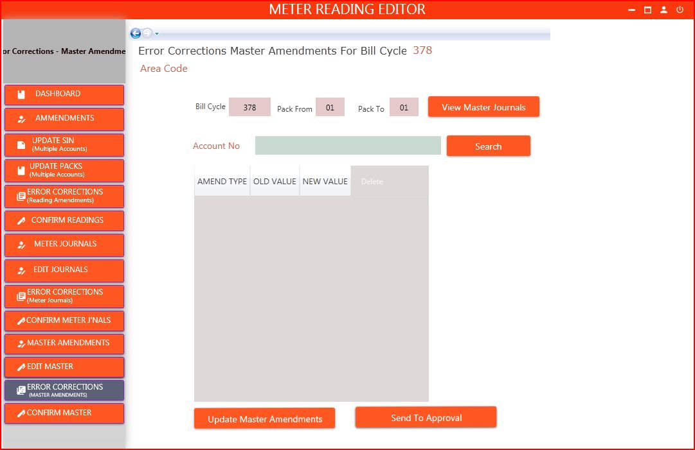

# USER LOGIN


Steps,

- Select the user type form the dropdown list. (Ex: AD User, System User)
- Enter the user name.
- Enter Password.
- Click the Login button.


# METER READING AND MANAGEMENT
## Main Dashboard


Main Dashboard includes,

- Total number of meter readings related to the bill cycle.
- Total number of meter readings that has completed related to the bill cycle.
- Total number of meter readings remains related to the bill cycle.
- Display consumers by block units related to the bill cycle.
- Display consumers by its tariff related to the bill cycle.
- By entering the bill cycle and click view button to get the above details.


## Side Menu 


Sidebar includes,

1.	Navigate to the Dashboard.
2.	Navigate to the Edit Readings page.
3.	Navigates to the Reports page.
4.	Navigate to the customer view page.


# EDIT READINGS
## Dashboard


1.	Task bar icons,
   • Minimize
   • Maximize
   • Data Entry User
   • Close
2.	Rejected Readings - Readings which are reject after processing
3.	Pending Approvals (Amendments) – Approvals which are not approved by the approval user level.
4.	Number of Pack Changes.
5.	Number of Sin Changes.
6.	Number of Sin and Pack Changes.
7.	Number of Meter Journals at that time.
8.	Number Rejected of Meter Journals.
9.	Display Changes done in the readings.
10.	Display Reading Summery.


## Amendments


Amendments include,
1.	Bill Cycle
2.	Reader Code
3.	Pack From
4.	Pack To
5.	After entering the above details and click the view reading button, it display the readings in below screen (no.6)
6.	All the readings related to the above entered details.
7.	If there any changes in the parameters of any pack range it will highlighted with color relevant to that pack range
-	Green color – Depot/SIN Change
-	Light Blue – Walk Order/ Pack Change
-	Gray – SIN/Walk Order/Depot/Pack
8.	Enter Account Number and click Filter Grid button it will automatically filter and display records relevant to that Account number.
9.	Enter Walk Sequence and click Filter Grid button it will automatically filter and display records relevant to that Walk sequence.
10.	Select how you want to filter the records it will automatically filter the records and display

### Edit Reading Data-Popup Message


To change the parameters click on the record that you want to change.  Then it will display,
1.	A popup menu – here you can change the reading parameters
2.	Click the update button


## Update SIN-Multiple Accounts


Update SIN include,								
1. Bill Cycle
2. Start walk sequence
3. Reader code
4. Daily pack
5. End walk sequence
6. After entering the above record and click the “View readings” button, it display the in below screen “7”
8. Enter New deport 
9. Enter new substation
10. Fill the above details and click the Update button


## Update Packs-Multiple Accounts


Update pack include,								
1. Bill Cycle
2. Start walk sequence
3. Reader code
4. Daily pack
5. End walk sequence
6. After entering the above record and click the “View readings” button, it display the in below screen “7”
8. Enter new reader
9. Enter new daily pack
10. Enter start sequence
11. Fill the above details and click the Update button it will shuffle the work sequence and update the recode 

## Error Corrections(Reading Amendments)


To correct the Errors of reading Amendments select on the records that you want to correct.  
1. Bill Cycle
2. Reader Code
3. Pack From
4.  Pack To
5. After entering the above details and click the view reject reading button, it display the readings in below screen
6. If there any changes in the parameters of any pack range it will highlighted with color relevant to that pack range
•	Green color – Depot/SIN Change
•	Light Blue – Walk Order/ Pack Change
•	Gray – SIN/Walk Order/Depot/Pack
7.  Enter Account Number which rejected readings
8. Click Filter Grid button it will automatically filter and display records relevant to that Account number.
9. Display records relevant to that Account number.
10. After the Error corrections Click on the approve reading Amendments

## Confirm Readings


Confirm Readings include,
1.	Bill Cycle
2.	Reader Code
3.	Pack From
4.	Pack To
5.	After entering the above details and click the view reading button, it display the readings in below screen (no.8)
6.	Enter Account Number and click Filter Grid button it will automatically filter and display records relevant to that Account number.
7.	Select how you want to filter the records it will automatically filter the records and display 
8.	All the readings related to the above entered details.
9.	Click for send to approval.

## Meter Journals


Meter Journals include,
01. Enter Bill Cycle number 
02. Enter Account Number 
03. After entering the above details and click the Search button, it display details of the journals in below screen (04)
05. When click the Add New Meter it display the screen bellow
06. That screen has three tabs
1. Meter 01- In this tab can only replace meter journals.
2. Meter 02- In this tab can add, remove and replace meter journals.
3. Meter 03- In this tab also can add, remove and replace meter journals.
07. After do the changes in the display screen click the Save Data button

## Edit Journals


Edit Meter Journals include,
01. Enter Bill Cycle 
02. Enter Rear From
03. Enter Reader To 
04. After entering the above details click the View Meter Journals button. It display the journals in bellow table.(6) 
05. If there any changes in the parameters of any Meter journal it will highlighted with color,
•	Green color – Replace Meter
•	Light Blue – Add new meter
•	Gray – Remove Meter
07. Double click on the meter journal it display the pop up message box. After changing the meter click Update Meter Info button (08)

## Error Corrections(Meter Journals)


Error Correction include,
01. Enter Bill Cycle 
02. Enter Rear From
03. Enter Reader To 
04. After entering the above details click the View Reject Meter Journals button (04). It displays the journals in bellow table. 
05. If there any changes in the parameters of any meter journal it will highlighted with color relevant to that meter journal
•	Light Blue – Rejected by journal process
•	Gray – Rejected by MRMS application
06. Enter Account Number which rejected meter journals
07. Click Filter Grid button it will automatically filter and display records relevant to that Account number.
08. Display records relevant to that Account number.
Note- If there is an error in the meter journal, when double click on the meter journal open pop up message and display error.
09. After the Error corrections Click on the approve meter journals button

## Confirm Meter Journals


After adding meter journals, Edit meter journals and Error correcting in the meter journals, process must be confirmed.
Confirm meter journals,
01. Enter Bill Cycle 
02. Enter Rear From
03. Enter Reader To 
04. After entering the above details click the View Meter Journals button (04). It displays the journals.
05. Enter Account Number which confirmed meter journals
06.  Click Filter Grid button it will automatically filter and display records relevant to that Account number
07. Enter package from
08. Enter package to
09. After entering the above details click the Filter Grade button (10). It displays the journals in the table below.
11. After the checking the meter journals Click on the approve meter journals button

## Master Amendments


Master Amendments includes,
1.	Enter account number.
2.	Select Amendment type you want.
3.	If there is a previously added value it will display as the Old Value.
4.	Add the New Value
5.	Click add button to add the above details to the grid.
6.	If you want to delete an amendment added to the grid click this delete button.
7.	Click the Add Master Amendment button to add the amendments done in the grid.

## Edit Master


If there any changes in Master Amendments, it can be done using Edit Master.
1. Bill Cycle
2. Pack Form
3. Pack To
4. After entering the above details click the View Meter Journals button.
5. Enter Accounts number 
6. After Entering the Accounts number, click on the search button.
7.  New value will enable to done changes in Amendments 
8. Click on the Update master Amendments

## Error Corrections(Master Amendments)


Error Correction include,
1. Bill Cycle
2. Pack From
3. Pack To
4. After entering the above details click the View Meter Journals button.
5. Enter Accounts number
6. After Entering the Accounts number, click on the search button.
7. New value will enable to done changes in Amendments.
8. Click on the Update Master Amendments 
9. After the click update button click on the Send to Approval Button

## Confirm Master


Confirm Master includes,
1.	Enter Bill Cycle.
2.	Enter Pack From.
3.	Enter Pack To.
4.	After entering the above details and click the view Master Journals button, it display the readings in below screen
5.	Enter Account Number and click Filter Grid button it will automatically filter and display amendments relevant to that Account number in the below screen(no.6)
6.	Click Send to approval button.

# APPROVAL USER FUNCTIONS


1.	In the approval user level it will enable this Approve Readings button.

## Dashboard


Approval Readings Dashboard includes,
1.	Total number of meter readings related to the bill cycle.
2.	Total number of meter readings that has completed related to the bill cycle.
3.	Total number of meter readings remains related to the bill cycle.
4.	Display number of pending approvals (Reading amendments).
5.	Display number of Rejections (Reading amendments).
6.	Display Reading Changes.
7.	By entering the bill cycle and click view button to get the above details.


## Process Meter Journals


Process meter journal include,
01. Enter Bill cycle
02. Enter Reading from
03. Enter Reading to
04. After entering the above details and click the view Master Journals button, it display the readings in below screen
05. Enter Account Number and click Filter Grid button it will automatically filter and display meter journal relevant to that meter journal in the below screen (no.9)
06. Enter Pack from
07. Enter Pack to
08. After entering the above details and click the view Filter grid button, it display the readings in below screen
10. Select Approval Status 
•	All records
•	Selected records
•	Reject selected records
11. After selecting approval status click on process meter journals button. That button is change according to selected approval status.
12. Remark- if rejected a meter journal you must put a remark


## Process Master


Process Master include,
1. Bill Cycle
2. Pack Form
3. Pack To
4. After entering the above details click the View master journal button
5. Enter the Account number given the space
6. After Entering the Accounts number, click on the filter grid button.
8. Select Approve status 
9. Remarks must fill for the submit process master amendments.
10. After select relevant details and click on the Process Master Amendments.

## Approve Amendments


Approve Amendments include,
1.	Bill Cycle
2.	Reader Code
3.	Pack From
4.	Pack To
5.	After entering the above details and click the view reading button, it display the readings in below screen (no.6)
6.	All the readings related to the above entered details.
	If there any changes in the parameters of any pack range it will highlighted with color relevant to that pack range
•	Green color – Depot/SIN Change
•	Light Blue – Walk Order/ Pack Change
•	Gray – SIN/Walk Order/Depot/Pack
7.	Enter Account Number and click Filter Grid button it will automatically filter and display records relevant to that Account number.
8.	Select how you want to filter the records it will automatically filter the records and display.
9.	Select how you want to approve or reject the records form select approve status.
•	Reject selected records – to reject only the selected records
•	Select all records – to approve or reject all the records
•	Approve selected records – to approve only the selected records
10.	Select the status from select approve status and click this button.(it will change according to the status you select form the approve status)
11.	If you reject an amendment you have to set a remark. (It is mandatory).


## Reading Confirm


Reading confirms includes,
01 Pack completion bill cycle
02. Area cord
03. Daily pack
04. Display completed rearing according to daily pack number in the table.
05. Display, 
•	Total accounts
•	Total read accounts
•	Total missing readings
06. After all readings are completed in the pack click on the complete pack for reading button.
07. Display process of the pack completion progress.


## Printing Confirm


After confirmed the reading can print the reading. It display confirmed packs according to reading confirmed process. The printing confirm includes,
01 Pack completion bill cycle
02. Area cord
03. Daily pack
04. Display confirmed document in the table.
05. Display process of the pack completion progress for printing


## End Bill Cycle


1. End Bill Cycle counter, after submit update into new cycle.
2. Show the reading and printing in front of the Daily pack.
3. After completing all pack, enable End Bill Cycle button.


## Reject Readings


Reject reading include
1. Bill Cycle
2. Reader Code
3. Pack From
4. Pack To
5. After entering the above details click the View reject Reading button.
6. Enter the Account number given the space 
7. After Entering the Accounts number, click on the filter grid button.
8. All the reject readings are fill in the grid view.


# REPORTS
## Dashboard


## Meter Readings


Meter Readings include,
1. Bill Cycle
2. Reader Code
3. Pack From
4. Pack To
5. After entering the above details click the View Readings button it will display all the meter readings.

## Error Summary(Pack Wise)


Error Summary (pack wise) include,
1. Bill Cycle
2. Reader Code
3. Pack From
4. Pack To
5. After entering the above details click the View Error Summary button, it will display error count if there is an error in pack wise.

## Error Summary(Reader Wise)


Error Summary (Reader Wise) include,
1. Bill Cycle
2. Reader Code
3. Reader To
4. After entering the above details click the View Error Summary button, it will display error count if there is an error in reader wise.

## Meter Journals


Meter Journals include,
1. Bill Cycle
2. Area
3. After entering the above details click the View journals button, it will display all the journals related to those details.
4. Approve Status will be changed,
•	New Journal – if it is a newly added journal.
•	Pending Approvals – Before processing the journal.
•	Process to Billing – processed journal.
•	Rejected from Billing 
•	Rejected from Approval Level

## SIN Changes


SIN changes report include 
01. Enter area code
02. Enter bill cycle
03. Enter area and click on view SIN changes button (4) .It display bellow report,
05. The SIN changes report display address, reader code, old walk order, new walk order, old pack, new pack and status. The status can be,
			01. New Entry
			02. Approved
			03. Pending Approval 


## Pack Changes


Pack changes report include 
01. Enter area code
02. Enter bill cycle
03. Enter area and click on view complete packs button (4). It display bellow report
05. The pack changes report display address, reader code, old walk order, new walk order, old pack, new pack and status. The status can be,
			01. New Entry
			02. Approved
			03. Pending Approval 


## Pack Completion


Pack completion report include 
01. Enter area code
02. Enter bill cycle
03. Enter area and click on view complete packs button (4). It display bellow report
05. Completed readings for print 

## Reading Completion


Reading completion summary include,
01. Enter area code
02. Enter bill cycle
03. Enter area and click on view reading summary button (4). It display bellow report
05. Reading completion summary report include, Total readings, Submitted process summary, unread, confirm for cycle end and is mismatch. This report provides a complete summary of whole area bill cycle and reading full summary.

## Unread Readings


Un-Read summary report includes missing reading in pack.
Pack changes report include 
01. Enter area code
02. Enter bill cycle
03. Enter reader code
04. Enter Pack from
05. Enter Pack to and click on view readings button (6). It display bellow report
07. The un-read summary report display account no, name, Daily pack, walk sequence, tariff class. 

#### JS snippet

Auto formatted.

```markdown
[example.js](_media/example.js ':include' )
```

[example.js](_media/example.js ':include' )

#### Markdown snippet

Force to code snippet.

```markdown
[_sidebar.md](_coverpage.md ':include :type=code')
```

[_sidebar.md](_coverpage.md ':include :type=code')

#### Warnings

- Do not put the URL in a bullet point as it will become an ordinary link.
- Do not put two embed items in a sequence without some characters in between, otherwise you will get a JS error rending the page. Putting an empty line between them is **not** sufficient.
- If you embed a URL of a Github file, remember to use the _Raw_ URL otherwise you will get an error.


## Docsify CLI

_Docsify_ also provides a convenient but optional CLI. It helps you create and serve a Docsify project. In particular, it provides hot reloading by default when using the server - an open localhost webpage will refresh when project files are saved.

### Setup

```bash
$ npm i docsify-cli -g
```

Links for installing and using the CLI.

- [Docsify Quickstart](https://docsify.js.org/#/quickstart) on _Docsify_ homepage.
- [Docsify CLI](https://docsifyjs.github.io/docsify-cli) project's docs.

### Commands

#### init

> Creates new docs

Setup an initial _README.md_ (duplicated from project root), _index.html_ and _.nojekyll_ in your a target directory. If you don't want the CLI to do it for you, you can create the files by hand or use this project's _quickstart_ directory to get you going.

e.g.

```bash
$ docsify init docs
```

#### serve

> Run local server to preview site.

Serve the target directory as a docs site locally. This includes hot reload, to refresh the page on file changes. See [serve](#21-serve) options above.

e.g.

```bash
$ docsify serve docs
```

Serves as [localhost:3000/](http://localhost:3000/), or a different port if there is already a _Docsify_ server running.

#### start

> Server for SSR

This command is for Server-Side Rendering. I haven't tried this yet.

## Static site vs SPA

### Server side rendering

Although SEO crawlers can do better at sites like single page application, _Docsify_ is still said not to be SEO-friendly, compared with static sites where all HTML is pre-rendered.

However, _Docsify_ provides the option of pre-rendering all the views as static HTML. This can improve SEO.

See [Server-Side Rendering](https://docsify.js.org/#/ssr) section of the _Docsify_ docs.

### Why not use a static site generator?

_Docsify_ is a SPA, not a static-site generator.

_Jekyll_ and _Hugo_ are excellent options for static site generators. They can use themes suited to documentation and they can build off of a _docs_ directory. If you want to read more about those, see my [resources](https://github.com/MichaelCurrin/static-sites-generator-resources) project.

These are just tools to build a site. What is appropriate depends on your usecase, how much you need to customized the site and how much effort you want to spend on installing/running/maintaining the project.

I find _Docsify_ light to add to a project and to use for new projects. So it is a great fit for me.

A static site generator can be heavy to setup and manage.

There are dependencies to manage - they might have to be upgraded if their are security vulnerabilities or they are no longer available. Such as plugins and themes for _Jekyll_. And plugins for _Hugo_. Plus you probably need a couple of _JavaScript_ or _CSS_ files that either you or a theme added. Such as _Query_. This _Docsify_ project only needs exactly one _JavaScript_ and one _CSS_ file.

There is HTML to build locally and on the remote. While _Docsify_ needs no dependencies to serve a site, _Jekyll_ sites needs `jekyll` installed and _Hugo_ sites need `hugo` available.

A static site needs to to customize it in depth or setup a theme which also takes effort. You may lose or gain functionality when switching between Jekyll themes because they use their own templates and layouts.

You probably have to add _front matter_ to your doc files so they can inherit from layouts and have the correct metadata like title.

As with _Docsify_, you will probably have to create a config file which covers the structure of your project for use in the sidebar.

Unlike building static files with HTML, with with Docsify there is a single page application running off of a _index.html_ - on each request, a markdown file is fetched by the client and rendered as HTML with a theme and menu. The performance will depend more on the server when serving static HTML pages (prebuild and serve page on the client) or on the client when using a single page application (build structure on the client).

Also, the _Docsify_ approach will only work if _JavaScript_ is enabled.

The _Docsify_ site says it supports back to Internet Explorer 11, so that at least helps for a wider audience of users.
